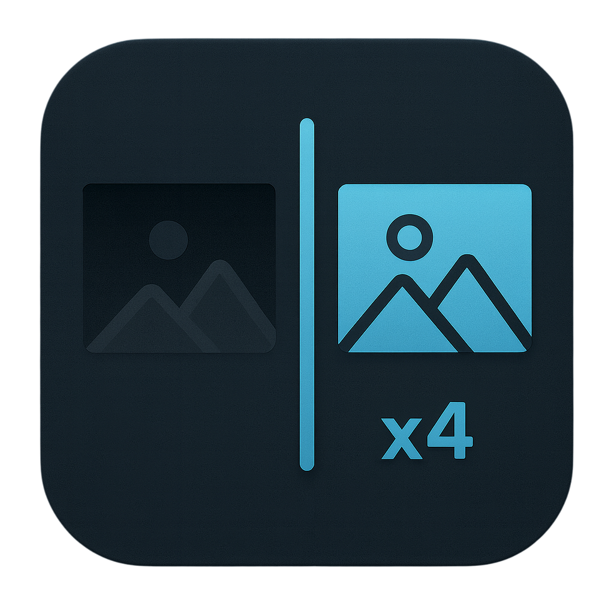

<p align="center">
  
</p>

<h3 align="center">저조도 이미지 복원 웹 서비스</h3>

<p align="center">
  Retinexformer 기반 저조도 향상 + Real-ESRGAN 초해상도 복원을<br>
  브라우저에서 간편하게 체험하는 2단계 이미지 복원 웹 서비스입니다.<br><br>
  <b>v0.2.0 (Preview)</b>
  <br>
  <a href="https://fridai.vercel.app/"><strong>Open Live Demo »</strong></a>
  <br><br>
  <a href="https://github.com/F-R-I-D-AI/dashboard-ui/issues/new?labels=bug&template=bug_report.yml">Report bug</a>
  ·
  <a href="https://github.comF-R-I-D-AI/dashboard-ui/issues/new?labels=enhancement&template=feature_request.yml">Request feature</a>
</p>

---

## Demo

<p align="center">
  
</p>


## Tech Stack


## Directory Structure

```
lowlight-restore-web/
├── README.md                       /* README */
├── app/                            /* Next.js App Router */
│   ├── api/mock/                   /* 개발자용 로컬 API */
│   ├── page.tsx                    /* 메인 페이지 */
│   └── globals.css                 /* 전역 스타일 */
├── public/
│   └── mock/                       /* 개발자용 로컬 데이터 */
└── next.config.mjs
```


## Features

### 1. 얼굴 자동 탐지 (RetinaFace 기반)

* 업로드한 이미지에서 얼굴 위치를 자동으로 탐지
* Before/After 이미지 모두 얼굴 박스 오버레이 표시
* 정교한 정렬을 위해 이미지 렌더링 비율 계산

### 2. 저조도 + 초해상도 복원 (2단계 파이프라인)

* Retinexformer: 밝기·색상 보정
* Real-ESRGAN: 디테일 강화 & 노이즈 감소 (+Face enhancement)
* 비동기 Job Queue 기반 복원 진행
* 복원 시간 타이머 표시 (ms 단위)

### 3. Before / After 슬라이더 비교

* 마우스 드래그 또는 터치로 슬라이더 이동
* imgMeta 기반 object-contain 정렬로 정확한 박스 매핑
* 밝기/대비/채도 후처리 적용

### 4. 얼굴 Crop 자동 생성

* After 이미지에서 얼굴 영역만 정확히 Crop
* Scale factor 보정 적용 (원본 → 복원본 사이즈 대응)
* 그리드 UI로 탐지된 얼굴들을 한눈에 확인 가능

### 5. 클라이언트 기반 파일 처리

* 브라우저에서 이미지 미리보기
* Blob → File 변환하여 후처리 단계 재분석
* 다운로드 기능 제공


## API Endpoints

백엔드(FastAPI)에서 제공하는 라우트:

| Method | Endpoint            | Description       |
| ------ | ------------------- | ----------------- |
| `POST` | `/v1/detect_faces`  | 얼굴 탐지             |
| `POST` | `/v1/enhance`       | 이미지 복원 요청(Job 생성) |
| `GET`  | `/v1/jobs/{job_id}` | Job 상태 조회         |


개발자용 환경 변수 설정:

```
NEXT_PUBLIC_API_URL_V1=http://localhost:3000/api/mock
```


## Security(수정 필요)

* 모든 이미지 업로드·전송은 **직접 FastAPI 서버로만 전달**
* 외부 저장 없음, 복원 결과는 즉시 URL로 반환
* 클라이언트에서만 미리보기와 Crop 수행


## How to Run

### 1. Install dependencies

```bash
npm install
```

### 2. Set environment variables

`.env.local` 생성:

```
NEXT_PUBLIC_API_URL_V1=http://localhost:3000/api/mock
```

### 3. Run Dev Server

```bash
npm run dev
```

## License

MIT License — 자유롭게 사용 및 확장 가능합니다.
